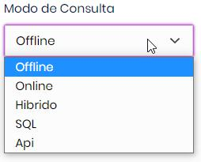

# Modos de Consulta para o Terminal

As opções do modo de consulta do Terminal são:  

- **Offline**: Conulta somente os produtos que estão no equipamento.
- **Online**: Consulta na nuvem.
- **Híbrido**: Usa o modo SQL/API para consulta do preço e conecta na nuvem (modo Online) para consultar informações adicionais.
- **SQL**: Consulta diretamente no SQL do ERP/Frente de caixa. É necessário ter cadastrado uma [conexão](https://cloud.supermidiadigital.com.br/Settings/ErpConnections).
- **Api**: Consulta diretamente na API do ERP (ainda indipoível na nuvem).

## Exemplos das consultas

Executar o [comando](../App/Comandos.md):  
`Barras 7894900011517`

