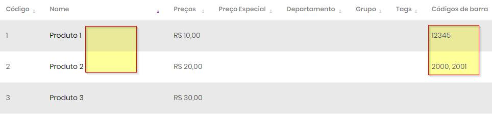

# Layout de arquivos

## Com tamanho das colunas fixas

### Características

- Geralmente arquivos gerados para as balanças
- Geralmente tem somente os produtos pesáveis (açougue e padaria)
- Nomes mais comuns dos arquivos: `TXITENS` e `ITENSMGV`

### Exemplo `TXITENS`

Note que é somente um exemplo, o seu arquivo pode variar.

```
01030000740000699000FEIJAO PRETO AGRANEL     
01030000741001790000FEIJAO VERMELHO AGRA     
01030000743000290000PEPINO JAPONES           
01030000744001390000SALAME DONADO DEFUMA     
01030000745000790000TOMATE ITALIANO          
```

#### Configuração

| Nome   | Pos.Inicial | Tamanho | Campo
|--------|-------------|---------|------
| Código | 6           | 6       |
| Nome   | 21          | 25      |
| Preço  | 12          | 6       |

```
Linha   =>  01030 000745 000790 000 TOMATE ITALIANO             
Posição =>        6      12         21
Campo   =>        Código Preço      Nome
```

### Exemplo `ITENSMGV`

Note que é somente um exemplo, o seu arquivo pode variar.

```
000000001004499004PAD TORTA BOMBOM/LEITE CONDENSADO kg              0000010000000001110000000000000000000000000000000000000000000000000004000000000000000000|00|                                                                      0000000000000000000000000||0||
010000002002590004PDD BOLO MILHO kg                                 0000020000000002110000000000000000000000000000000000000000000000000001000000000000000000|00|                                                                      0000000000000000000000000||0||
```
#### Configuração

| Nome   | Pos.Inicial | Tamanho | Campo
|--------|-------------|---------|------
| Código | 4           | 6       |
| Nome   | 19          | 50      |
| Preço  | 10          | 6       |

Para confirmar a posição inicial e tamanho, utilize o **Bloco de notas** ou o [VSCode](https://vscode.dev)


## Com separador

### Características

- Gerado por sistemas como **Open** e **Excel (CSV)**
- Geralmente tem todos os produtos
- Separadores mais comuns: `;` e `|`
- Nomes mais comuns dos arquivos: `TerminalSimix.txt`, `Terminal.txt`, `Produtos.csv`

### Exemplo

```
0000086;7896504305085;LEITE SEMIDESNATADO SANTA CLARA C/ TAMPA 1LT;MERCEARIA SECA;LEITE;23/04/2019;2.99;0.00;Sem promoção cadastrada;00/00/0000;00/00/0000
0000093;7896504305092;LEITE DESNATADO SANTA CLARA C/ TAMPA 1LT;MERCEARIA SECA;LEITE;17/05/2019;2.79;0.00;Sem promoção cadastrada;00/00/0000;00/00/0000
```

### Configuração

| Nome             | Pos.Inicial | Tamanho | Campo
|------------------|-------------|---------|------
| Código           | 1           |         | 
| Nome             | 3           |         | 
| Preço            | 7           |         | 
| Código de barra  | 2           |         | 

## Formatação avançada

Quando algum código estiver na descrição ele pode ser extraído e colocado no campo adequado.
Neste exemplo os códigos de barras estão dentro da descrição (tendo inclusive mais de um), não havendo um campo específico no layout para eles.  
Essa situação pode ser contornada com expressões regulares (Regex).

### Exemplo

```
1|Produto 1 (COD 12345)|R$ 10,00
2|Produto 2 (CÓDIGO 2000/2001)|R$ 20,00
3|Produto 3|R$ 30,00
```

### Configuração

| Nome             | Pos.Inicial | Tamanho | Campo  | Regex
|------------------|-------------|---------|--------|------
| Código           | 1           |         |        |
| Nome             | 2           |         |        |- \\(COD (.\*?)\\) \| \\(CÓDIGO (.\*?)\\)
| Preço            | 3           |         |        |
| Código de barra  |             |         | {Name} | \\(COD (.\*?)\\) \| \\(CÓDIGO (.\*?)\\)

Em **Nome** temos uma expressão regular com o prefixo **-**, para remover.  
Em **Código de barra** temos a mesma expressão regular, mas sem o **-** e com o campo {Name}, indicando que deve pegar o conteúdo do Nome e extrair tudo que houver na expressão.  
Pode ser usada várias expressões regulares separadas por |, nessa exemplo utilizado para localizar tanto  com o prefixo COD quando CÓDIGO.

As expressões regulares podem ser testadas em https://regex101.com/r/TwzThc/1

Resultado com o **Nome** sem os códigos, sendo extraídos para o campo **Códigos de barras**:

